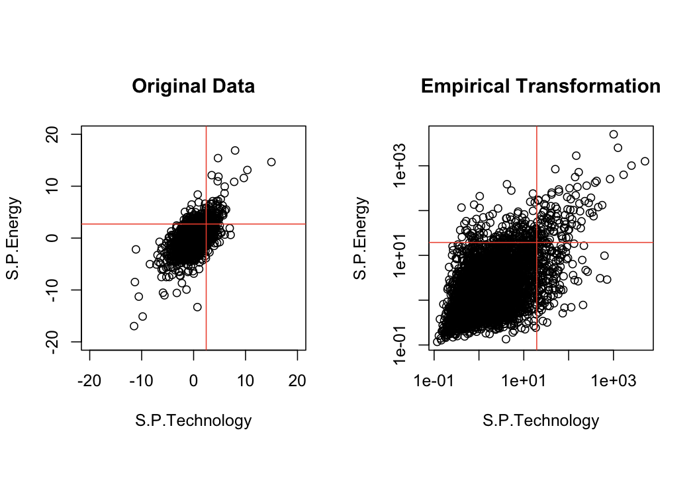
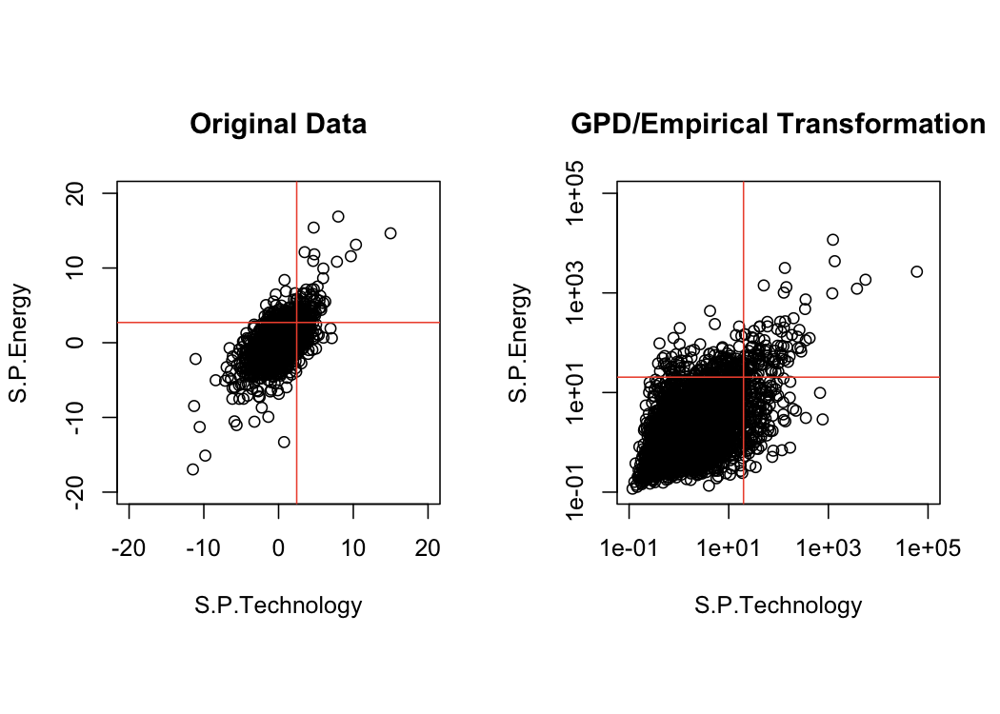
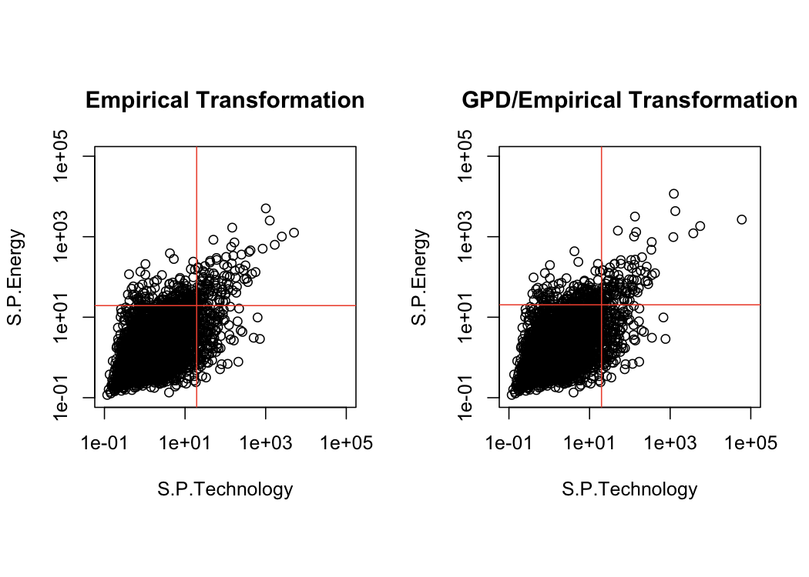
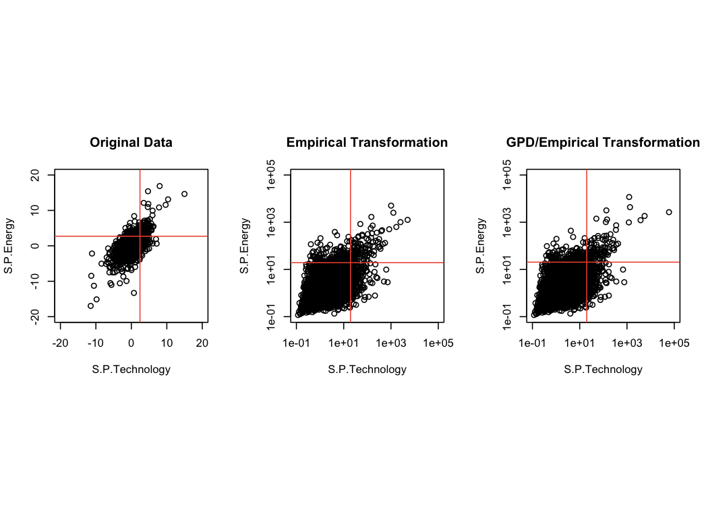

Standard Frechet Scale Transformation
================
Mongi Nouira

We present two approaches to transform the marginals to the Frechet
scale.

## Empirical Transformation

## Mixed GPD/Empirical Transformation

## Comparison

