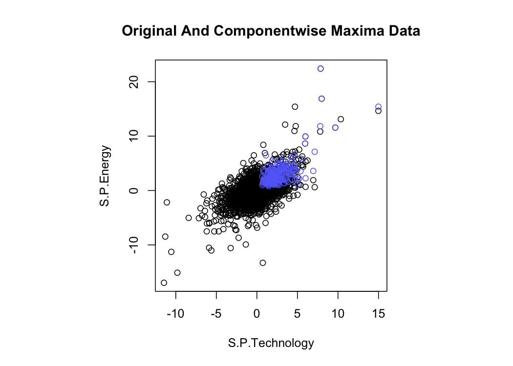
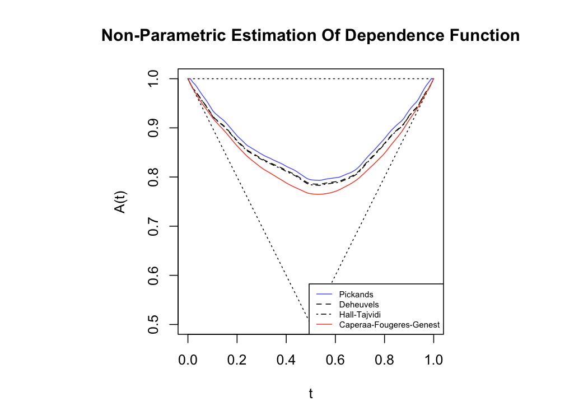
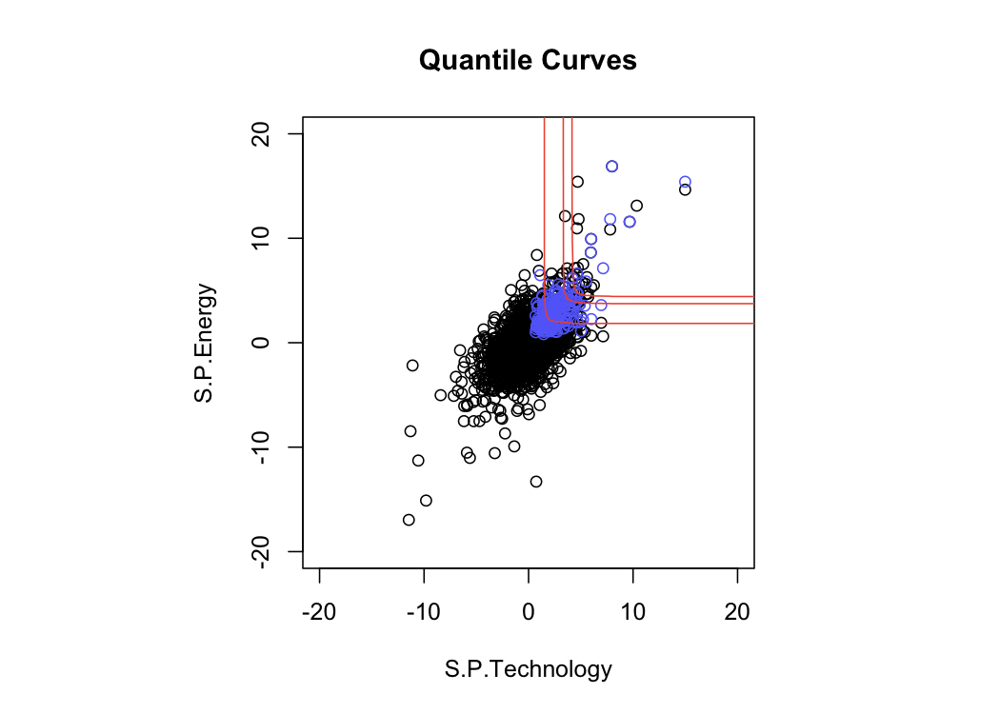
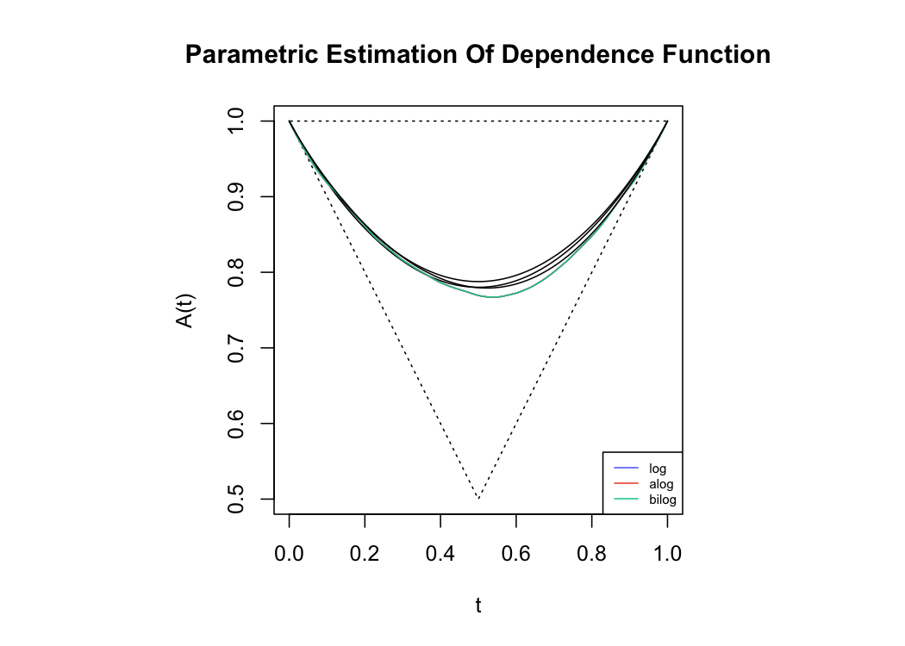

GEV Univariate/Bivariate - EDA
================
Mongi Nouira

We analyze the dependence between the technology and energy sectors.

## Component-Wise Block Maxima

We start by transforming the data into componentwise block maxima data
by taking the maximum of groups of 25 observations. This produces 201
maxima observations.

## Non-Parametric

First, we use various non parametric estimates of the dependence
function that also uses empirical estimation of the margins.

## Parametric

Second, we use maximum likelihood estimation for various parametric
Bivariate Extreme Value Distributions models.

The following shows the parameter estimates and their standard errors
corresponding to the log model.

|  loc1 | scale1 | shape1 |  loc2 | scale2 | shape2 |   dep |
| ----: | -----: | -----: | ----: | -----: | -----: | ----: |
| 1.962 |  0.973 |  0.150 | 2.258 |  1.048 |  0.244 | 0.642 |
| 0.077 |  0.061 |  0.049 | 0.083 |  0.069 |  0.052 | 0.041 |

Test logistic vs bilogistic model. Test of independence.

    ## Analysis of Deviance Table
    ## 
    ##    M.Df Deviance Df  Chisq Pr(>chisq)
    ## m2    8   1297.1                     
    ## m1    7   1297.9  1 0.8128     0.3673

    ## 
    ##  Score Test Of Independence
    ## 
    ## data:  cml
    ## norm.score = -21.334, p-value < 2.2e-16
    ## alternative hypothesis: true dependence is greater than independence
    ## sample estimates:
    ##      dep 
    ## 0.641843

