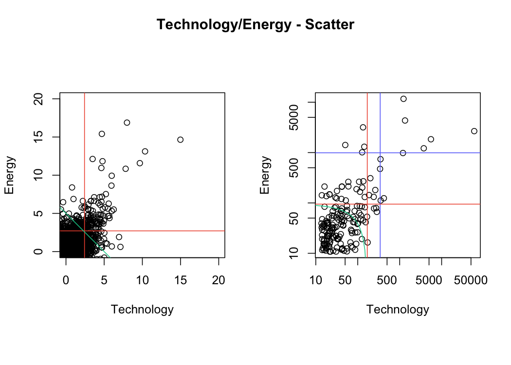

GPD Univariate - EDA
================
Mongi Nouira

``` r
knitr::opts_chunk$set(fig.align="center", echo=FALSE)
```

Using the univariate Generalized Pareto Distribution for EDA (Threshold
selection, Frechet Scale, …). We focus on the Technology sector.

    ## Loading required package: mgcv

    ## Loading required package: nlme

    ## Warning: package 'nlme' was built under R version 4.0.5

    ## This is mgcv 1.8-34. For overview type 'help("mgcv-package")'.

<div class="figure" style="text-align: center">


<p class="caption">

Mean Residual Life Plot

</p>

</div>

    ## $threshold
    ## [1] 5
    ## 
    ## $nexc
    ## [1] 24
    ## 
    ## $conv
    ## [1] 0
    ## 
    ## $nllh
    ## [1] 36.43958
    ## 
    ## $mle
    ## [1] 1.2279738 0.3128952
    ## 
    ## $rate
    ## [1] 0.004757185
    ## 
    ## $se
    ## [1] 0.4311193 0.2926481

<div class="figure" style="text-align: center">



<p class="caption">

Fitted GPD With Threshold u=5 Diagnostic

</p>

</div>
