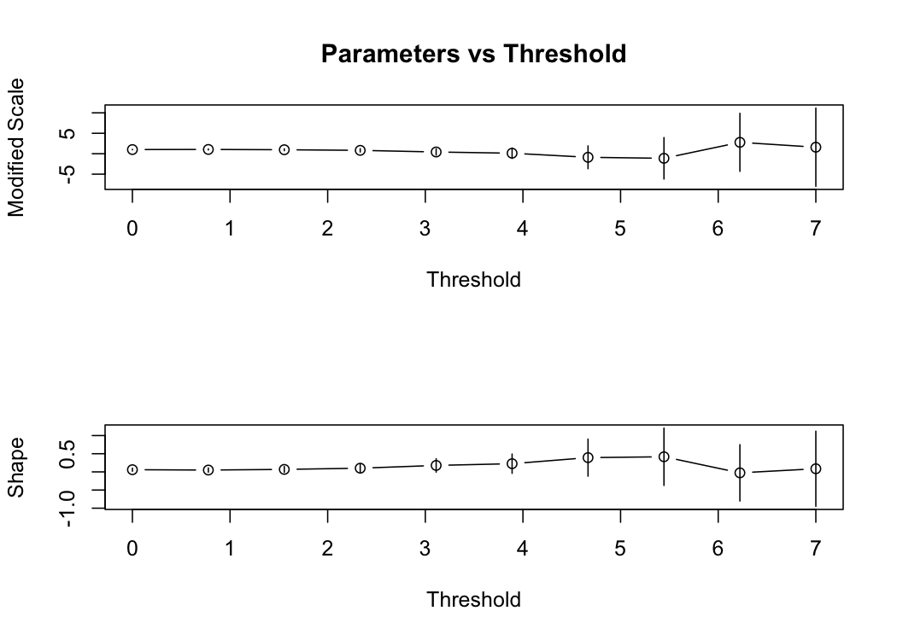

GPD Univariate/Bivariate - EDA
================
Mongi Nouira

Using the univariate Generalized Pareto Distribution for EDA (Threshold
selection, Frechet Scale, …). The time series correspond to log daily
losses. We focus on the Technology sector.

## Technology Sector

Mean Residual Life Plot

Parameters vs Threshold

    ## $threshold
    ## [1] 2
    ## 
    ## $nexc
    ## [1] 367
    ## 
    ## $conv
    ## [1] 0
    ## 
    ## $nllh
    ## [1] 424.1191
    ## 
    ## $mle
    ## [1] 1.07588779 0.08239063
    ## 
    ## $rate
    ## [1] 0.07274529
    ## 
    ## $se
    ## [1] 0.07825049 0.05080156

Fitted GPD With Threshold u=2 Diagnostic

## Bivariate EDA : Technology/Energy

Technology/Energy Pair - Chi and Chi Bar Plots

Technology/Energy Pair - 95% Marginal Quantiles

Technology/Energy Pair - 95% Marginal Quantiles - Frechet Scale

