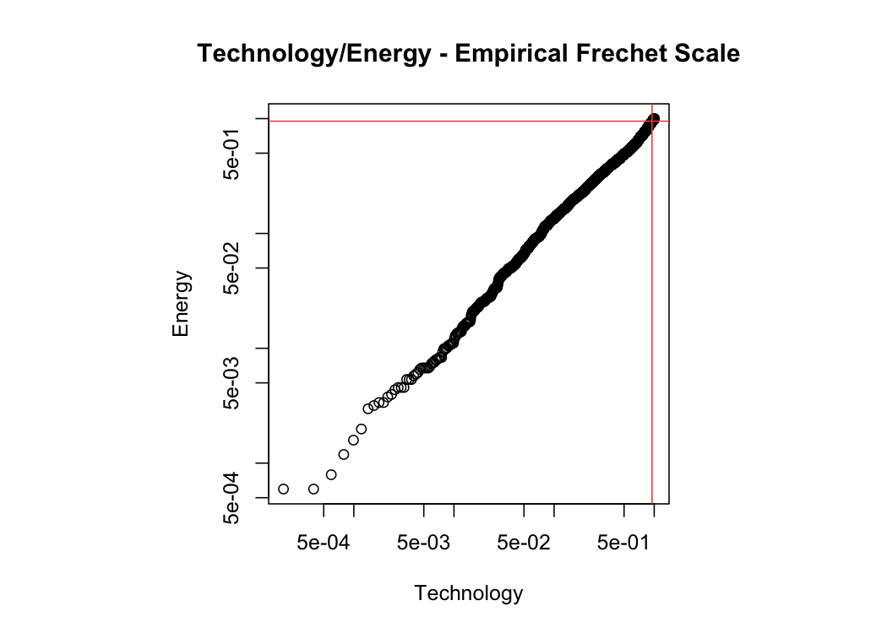
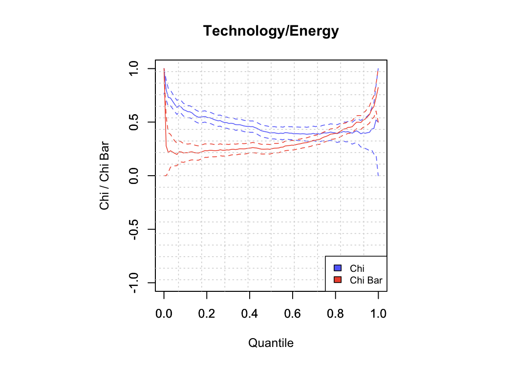
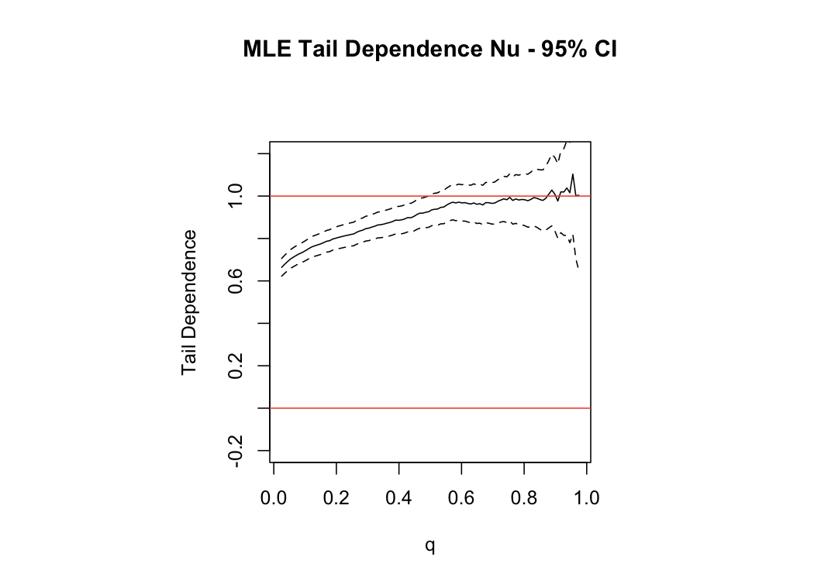

GPD Univariate/Bivariate - EDA
================
Mongi Nouira

Using the univariate Generalized Pareto Distribution for EDA (Threshold
selection, Frechet Scale, …). The time series correspond to log daily
losses. We focus on the Technology sector.

## Technology Sector

Mean Residual Life Plot

Parameters vs Threshold

    ## $threshold
    ## [1] 5
    ## 
    ## $nexc
    ## [1] 24
    ## 
    ## $conv
    ## [1] 0
    ## 
    ## $nllh
    ## [1] 36.43958
    ## 
    ## $mle
    ## [1] 1.2279738 0.3128952
    ## 
    ## $rate
    ## [1] 0.004757185
    ## 
    ## $se
    ## [1] 0.4311193 0.2926481

Fitted GPD With Threshold u=5 Diagnostic

## Bivariate EDA

Technology/Energy Pair - 95% Marginal Quantiles

Technology/Energy Pair - 95% Marginal Quantiles - Frechet Scale

