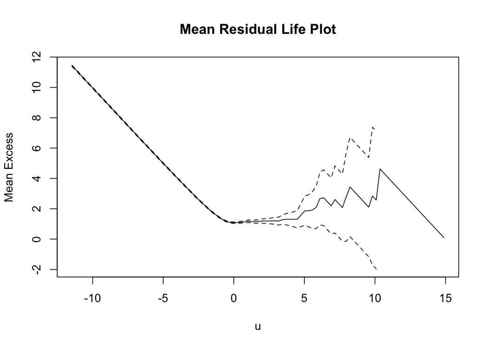

GPD Univariate/Bivariate - EDA
================
Mongi Nouira

Using the univariate Generalized Pareto Distribution for EDA (Threshold
selection, Frechet Scale, …). The time series correspond to log daily
losses. We focus on the Technology sector.

## Technology Sector

First, we look at the mean residual life plot with 95% confidence
intervals. It is initially linear the shows curvature between -1 and 5
then is reasonably linear relatively to confidence intervals. This may
suggest that a loss of 5% is a good threshold. However, there are only
24 exceedances in the data of 5045 observations. The threshold of 2%
seems more appropriate with 367 exceedances.

Second, we look at the stability of GPD parameters when changing the
threshold. The selected threshold of 2 seems reasonable.

Finally, we fit the GPD with threshold u=2. It is summarised as
following :

    ## $threshold
    ## [1] 2
    ## 
    ## $nexc
    ## [1] 367
    ## 
    ## $conv
    ## [1] 0
    ## 
    ## $nllh
    ## [1] 424.1191
    ## 
    ## $mle
    ## [1] 1.07588779 0.08239063
    ## 
    ## $rate
    ## [1] 0.07274529
    ## 
    ## $se
    ## [1] 0.07825049 0.05080156

## Bivariate EDA : Technology/Energy

In this section, we are interested in the asymptotic dependence between
the technology and energy sectors.

First, we look at the scatter plots of the two sectors and the
corresponding 95% marginal quantiles. We can also do the same plot after
transformation to the Frechet scale and using the logarithmic scale for
the axis.

  - Left Figure : Plot of positive losses only.
  - Right Figure : Transformation to Frechet scale and using logarithmic
    scale using GPD with threshold 2. Only the exceedances are plotted.
  - Red Line : 95% marginal quantiles of losses (Original and
    Transformed to Frechet scale).
  - Blue Line : 95% marginal quantiles of the data plotted in the right
    figure.
  - Green Line : x+y=5 (Original and Transformed to Frechet scale).

We can compute the two marginals empirical cumulative distribution
function then transform both variables to the Frechet scale using the
formula \(\hat{X}=-\frac{1}{log(F_X(X))}\).

Second, we look at the chi plots with 95% confidence intervals. The
interpretation is not simple because the confidence intervals are large
i.e. a high variance of the estimators but it seems that
\(\bar\chi(q) \rightarrow 1\) when \(q \rightarrow 1\) with a value
around 0.65. This supports the asymptotic dependence between the two
sectors.

Finally, we fit the logistic bivariate extreme value distribution for
the exceedances over the threshold u=2.

    ## 
    ## Call: fbvevd(x = ll[sup_u, c(6, 7)], model = "log", std.err = FALSE) 
    ## Deviance: 1100.8 
    ## AIC: 1114.8 
    ## Dependence: 0.4329932 
    ## 
    ## Estimates
    ##   loc1  scale1  shape1    loc2  scale2  shape2     dep  
    ## 2.7285  0.6929  0.3923  3.0406  1.0431  0.4322  0.6480  
    ## 
    ## Optimization Information
    ##   Convergence: successful 
    ##   Function Evaluations: 52 
    ##   Gradient Evaluations: 11

We can also do the same thing using another function “evd::fbvpot” and
specifying the threshold u=2. Maximum-likelihood Fitting of Bivariate
Extreme Value Distributions to Threshold Exceedances.

