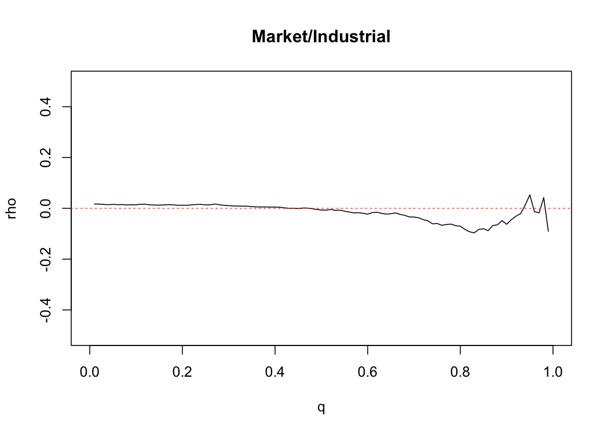
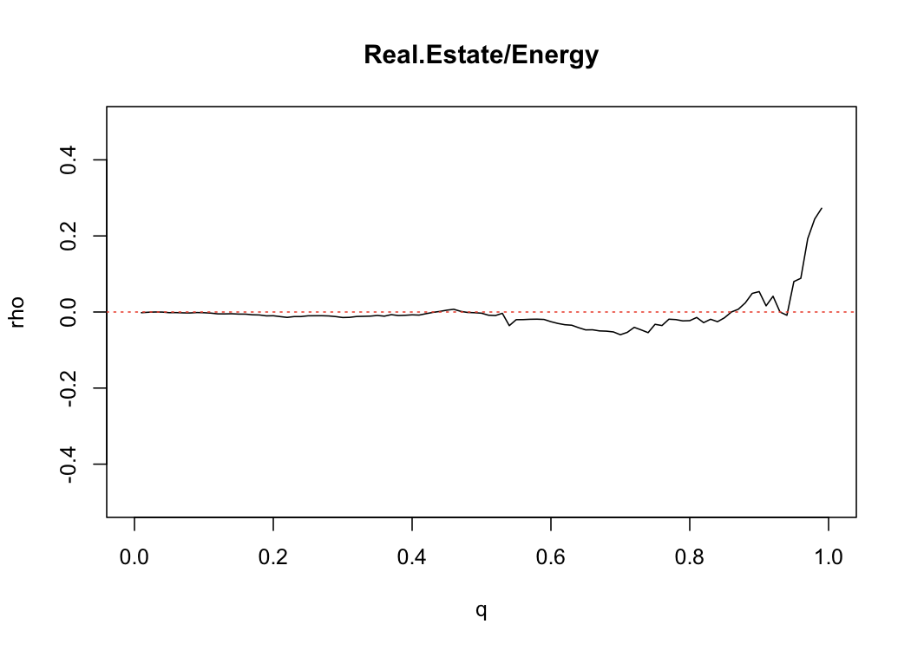
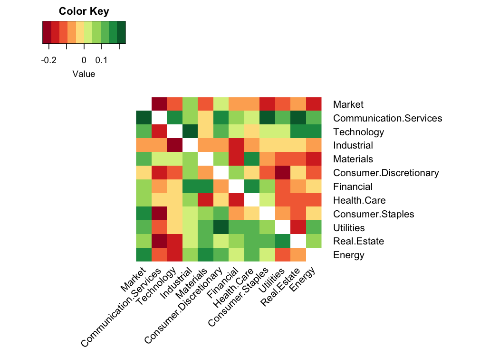

Coefficient Of Extremal Asymmetry
================
Mongi Nouira

We introduce a coefficient of extremal asymmetry which quantifies the
level of asymmetry in the structure of dependence between two random
variables at extreme levels.

## Extremal Symmetry - Examples

The number \(\rho\) reflects the tendency of one variable to be more
extreme than the other, given that both variables are extreme. We are
interested in the limit.

## Extremal Symmetry - All Sector Pairs Matrix

We look at the value for the 95% quantile which simply means using the
threshold 0.95 to compute the coefficient.

