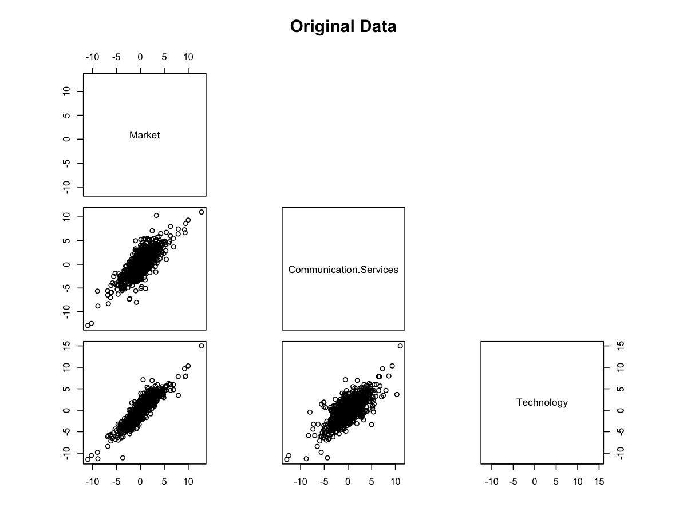
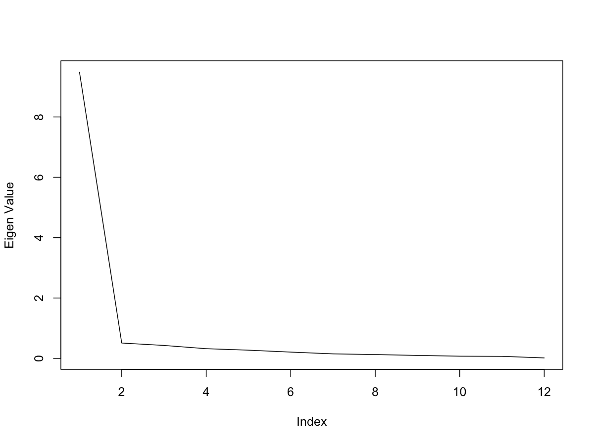

Multivariate Tail Dependence Decomposition
================
Mongi Nouira

We propose a decomposition which help to summarize and describe
multivariate tail dependence. It can be seen as an adaptation of PCA to
the extremes.

## Data Transformation

1.  Keep only positive losses.
2.  Apply bijection x-\>log(1+exp(x)).
3.  Scale variables using empirical/gpd mixture to Frechet scale
    transformation.

The last two transformations are required by the framework. In
particular, the tail index needs to be 2.

    ## [1] "---"

## Tail Pairwise Dependence Matrix

## Eigen Decomposition

### Eigen Values

### Eigen Vectors

## Principal Components Time Series

