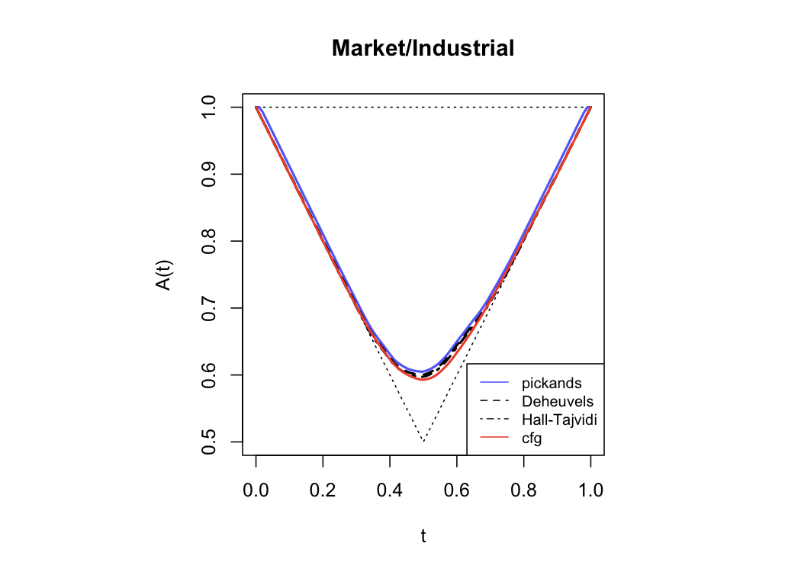
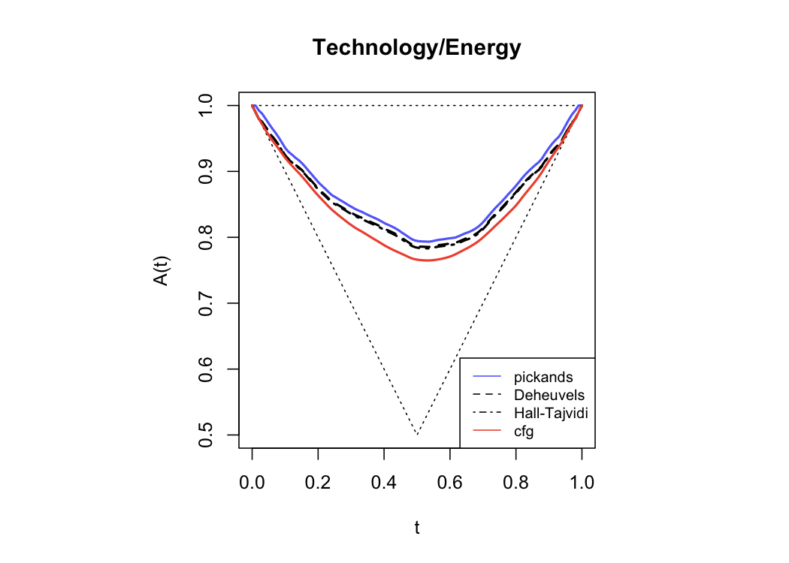
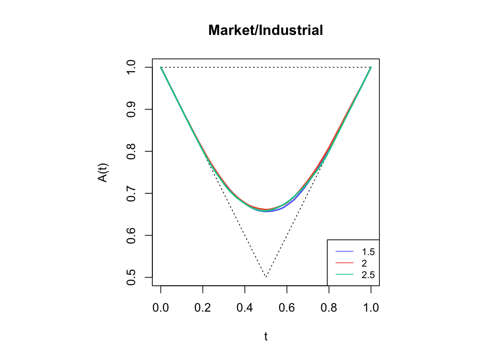
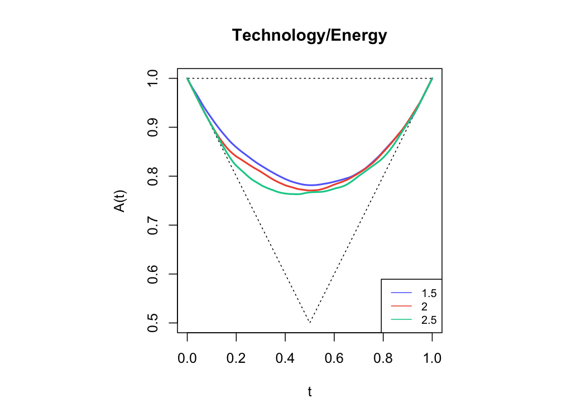

Dependence Functions Test
================
Mongi Nouira

We look at the dependence function by Pickands and other variations. We
use a non-parametric estimation of dependence function.

## Dependence Functions Variations

We use the component wise block maxima approach.

## Threshold Effect

We use the threshold exceedances approach. We compute the dependence
function using the observations that exceeds both thresholds.

