Test Package texmex
================
Mongi Nouira

    ## 
    ## Marginal models:
    ##                  Market Communication.Services Technology Industrial Materials
    ## Threshold         2.000                 2.0000      2.000      2.000     2.000
    ## P(X < threshold)  0.957                 0.9459      0.927      0.945     0.932
    ## sigma             0.968                 1.1523      1.076      0.982     1.089
    ## xi                0.201                 0.0923      0.081      0.202     0.171
    ## Upper end point     Inf                    Inf        Inf        Inf       Inf
    ##                  Consumer.Discretionary Financial Health.Care Consumer.Staples
    ## Threshold                         2.000     2.000       2.000            2.000
    ## P(X < threshold)                  0.944     0.924       0.966            0.980
    ## sigma                             0.996     1.287       0.930            0.817
    ## xi                                0.138     0.302       0.136            0.195
    ## Upper end point                     Inf       Inf         Inf              Inf
    ##                  Utilities Real.Estate Energy
    ## Threshold            2.000       2.000  2.000
    ## P(X < threshold)     0.961       0.932  0.910
    ## sigma                1.081       1.476  1.059
    ## xi                   0.167       0.311  0.247
    ## Upper end point        Inf         Inf    Inf
    ## 
    ## Dependence model:
    ## 
    ##   Communication.Services Technology Industrial Materials Consumer.Discretionary
    ## a                  0.632      0.165      0.284     0.358                  0.437
    ## b                  0.356      0.551      0.649     0.577                  0.615
    ## c                  0.000      0.000      0.000     0.000                  0.000
    ## d                  0.000      0.000      0.000     0.000                  0.000
    ## m                  0.260      1.118      0.889     0.758                  0.701
    ## s                  0.787      0.518      0.346     0.517                  0.381
    ##   Financial Health.Care Consumer.Staples Utilities Real.Estate Energy
    ## a     0.606       0.453            0.391     0.288       0.107  0.820
    ## b     0.343       0.417            0.537     0.515       0.514  0.341
    ## c     0.000       0.000            0.000     0.000       0.000  0.000
    ## d     0.000       0.000            0.000     0.000       0.000  0.000
    ## m     0.523       0.684            0.594     0.530       0.982 -0.186
    ## s     0.585       0.666            0.659     0.861       0.756  0.787

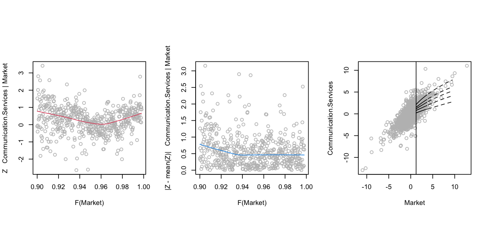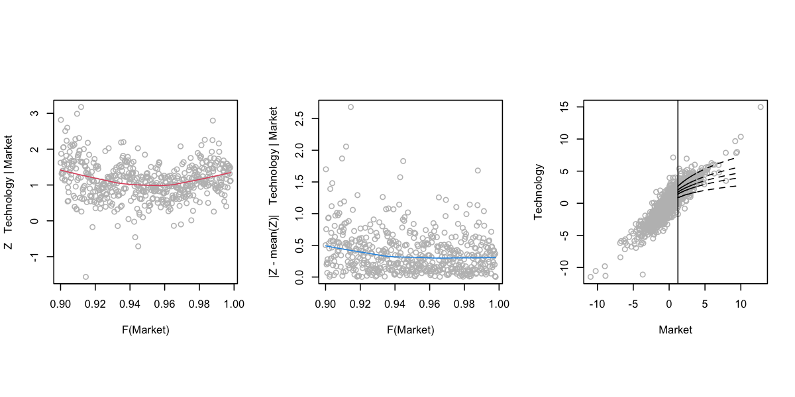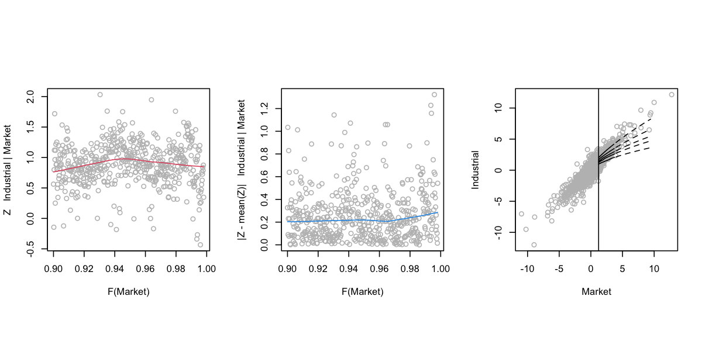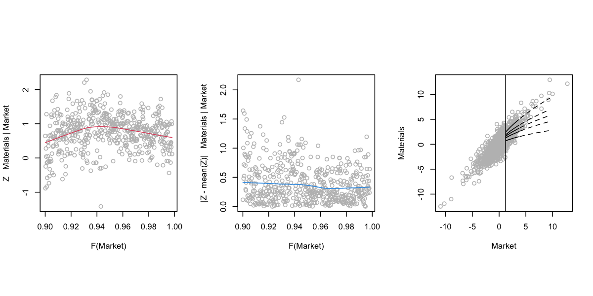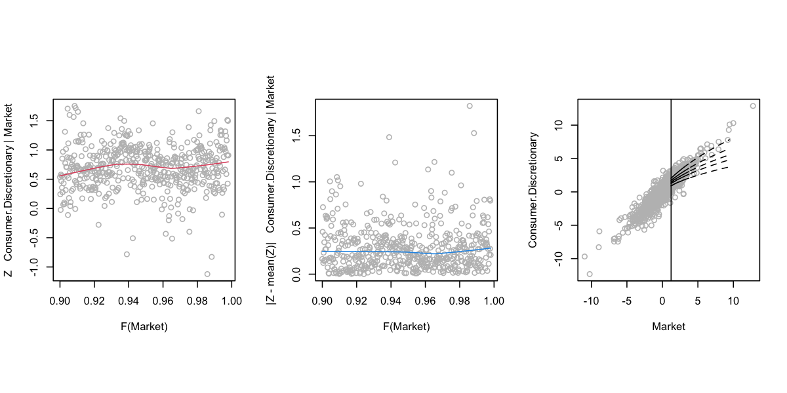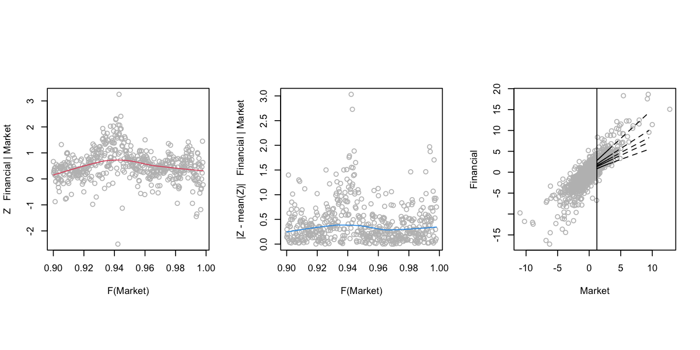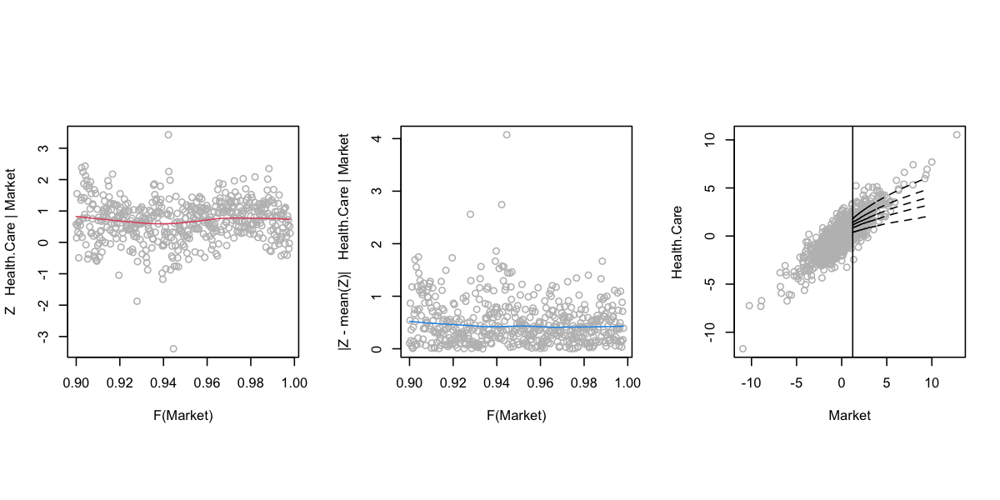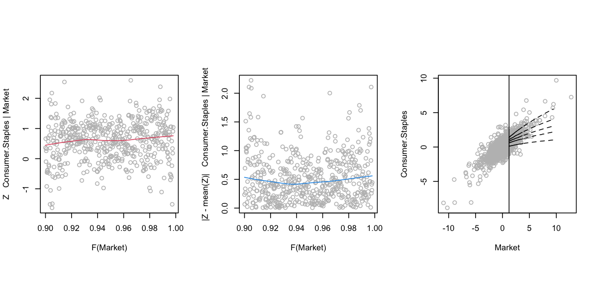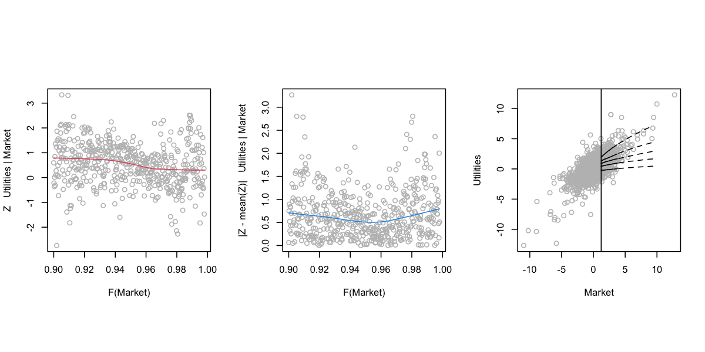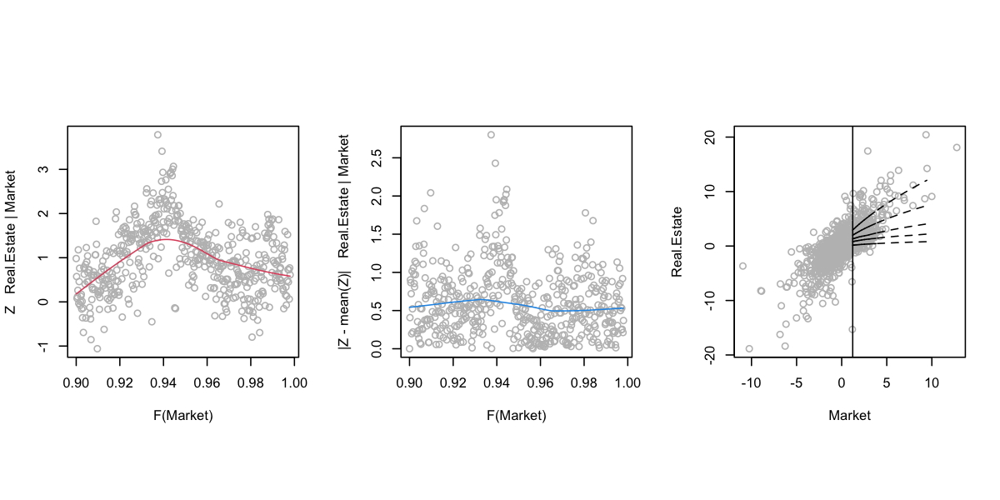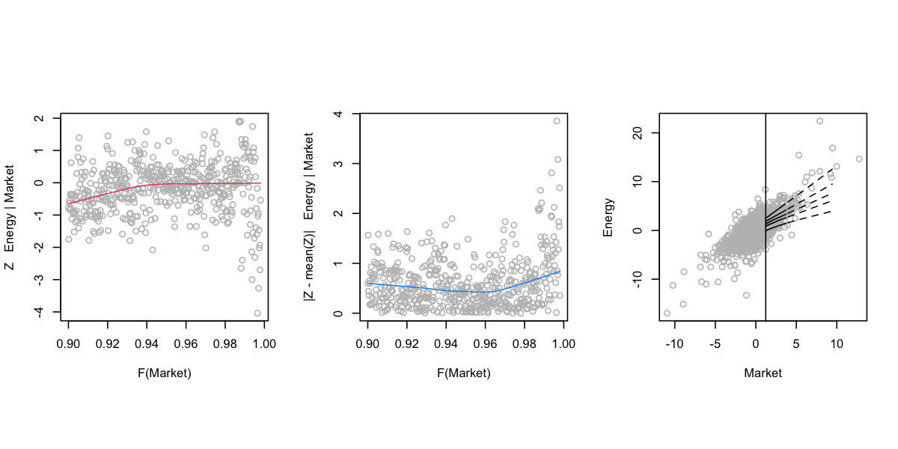

