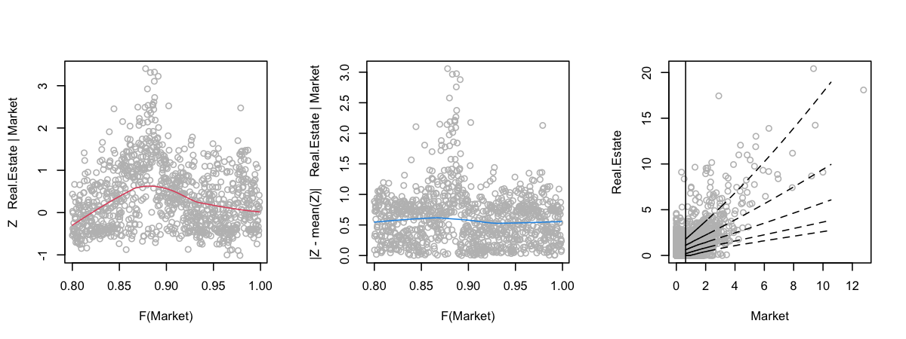
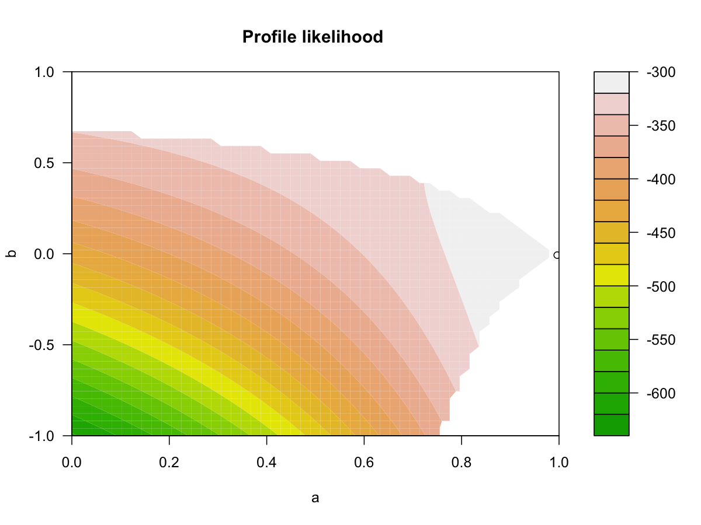
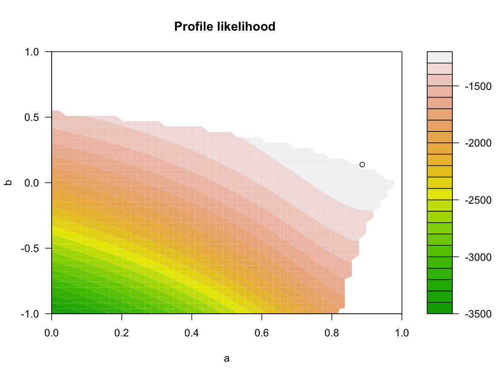

Test Package texmex
================
Mongi Nouira

## Marginal GPD Model Fit

### Summary

    ##                  Market Communication.Services Technology Industrial Materials
    ## Threshold          1.22                   1.38      1.645       1.38      1.57
    ## P(X < threshold)   0.90                   0.90      0.900       0.90      0.90
    ## sigma              0.85                   0.99      1.069       0.95      1.05
    ## xi                 0.19                   0.14      0.074       0.17      0.16
    ## Upper end point     Inf                    Inf        Inf        Inf       Inf
    ##                  Consumer.Discretionary Financial Health.Care Consumer.Staples
    ## Threshold                          1.45      1.67        1.14             0.92
    ## P(X < threshold)                   0.90      0.90        0.90             0.90
    ## sigma                              0.90      1.15        0.74             0.55
    ## xi                                 0.15      0.32        0.17             0.23
    ## Upper end point                     Inf       Inf         Inf              Inf
    ##                  Utilities Real.Estate Energy
    ## Threshold             1.25        1.59   1.85
    ## P(X < threshold)      0.90        0.90   0.90
    ## sigma                 0.73        1.07   1.09
    ## xi                    0.27        0.42   0.22
    ## Upper end point        Inf         Inf    Inf

### Diagnostic

Done in EDA section.

## Dependence Model Fit

### Summary

    ## Conditioning on Market variable.
    ## Thresholding quantiles for transformed data: dqu = 0.8
    ## Using laplace margins for dependence estimation.
    ## Constrained estimation of dependence parameters using v = 10 .
    ## Log-likelihood = -1311 -1121 -907 -1134 -978 -1070 -1217 -1309 -1430 -1376 -1355 
    ## 
    ## Dependence structure parameter estimates:
    ##   Communication.Services Technology Industrial Materials Consumer.Discretionary
    ## a                   0.47       0.12       0.50      0.60                   0.25
    ## b                   0.39       0.57       0.48      0.37                   0.59
    ##   Financial Health.Care Consumer.Staples Utilities Real.Estate Energy
    ## a      0.65        0.43             0.45      0.71        0.50   0.50
    ## b      0.32        0.43             0.38      0.28        0.39   0.35

### Diagnostic

### Dependence Model Threshold Selection

    ## mexRangeFit run time: 443.073 sec elapsed

### Dependence Model 2

    ## Conditioning on Market variable.
    ## Thresholding quantiles for transformed data: dqu = 0.75
    ## Using laplace margins for dependence estimation.
    ## Constrained estimation of dependence parameters using v = 10 .
    ## Log-likelihood = -1567 -1279 -978 -1303 -1061 -1231 -1392 -1556 -1709 -1624 -1595 
    ## 
    ## Dependence structure parameter estimates:
    ##   Communication.Services Technology Industrial Materials Consumer.Discretionary
    ## a                   0.77      0.862      0.968      0.88                  0.933
    ## b                   0.17      0.088      0.051      0.16                  0.098
    ##   Financial Health.Care Consumer.Staples Utilities Real.Estate Energy
    ## a      0.89        0.81             0.77      0.65        0.71   0.80
    ## b      0.14        0.20             0.18      0.31        0.20   0.18

