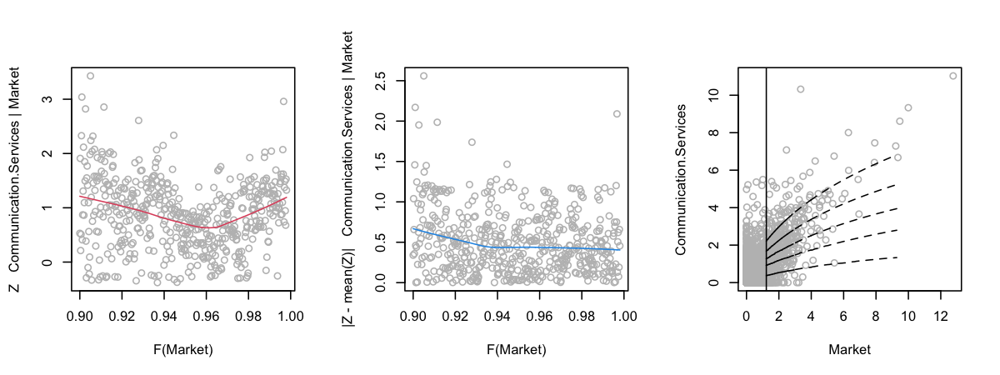
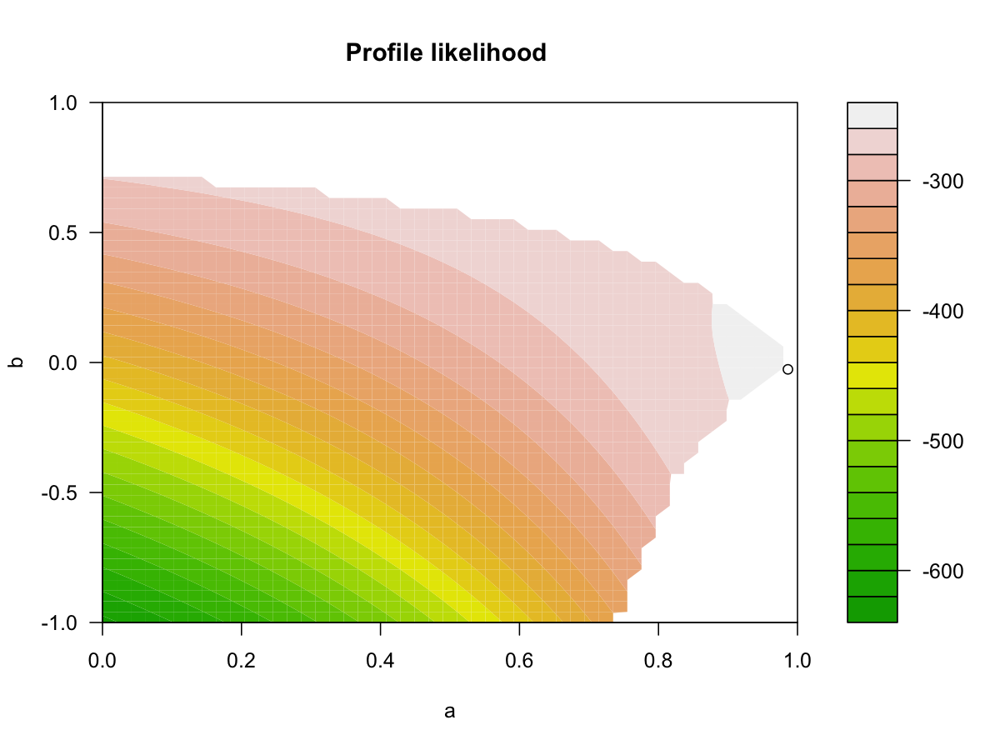
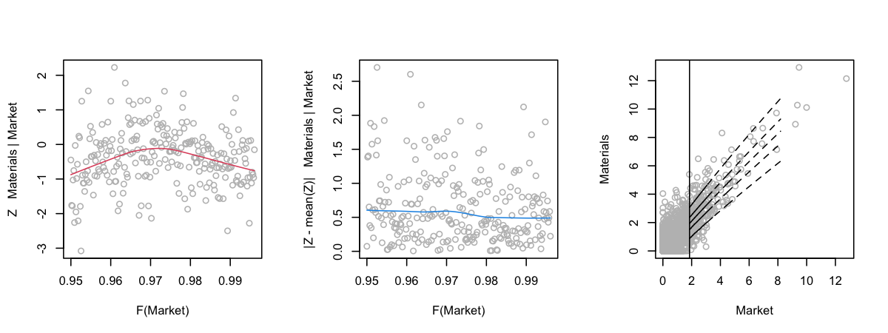
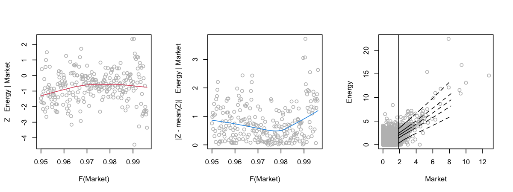

Test Package texmex
================
Mongi Nouira

## Marginal GPD Model Fit

### Summary

    ##                  Market Communication.Services Technology Industrial Materials
    ## Threshold          2.00                  2.000      2.000       2.00      2.00
    ## P(X < threshold)   0.96                  0.946      0.927       0.94      0.93
    ## sigma              0.96                  1.149      1.074       0.97      1.08
    ## xi                 0.21                  0.096      0.083       0.21      0.18
    ## Upper end point     Inf                    Inf        Inf        Inf       Inf
    ##                  Consumer.Discretionary Financial Health.Care Consumer.Staples
    ## Threshold                          2.00      2.00        2.00             2.00
    ## P(X < threshold)                   0.94      0.92        0.97             0.98
    ## sigma                              0.99      1.28        0.92             0.80
    ## xi                                 0.14      0.31        0.14             0.22
    ## Upper end point                     Inf       Inf         Inf              Inf
    ##                  Utilities Real.Estate Energy
    ## Threshold             2.00        2.00   2.00
    ## P(X < threshold)      0.96        0.93   0.91
    ## sigma                 1.07        1.46   1.05
    ## xi                    0.18        0.33   0.25
    ## Upper end point        Inf         Inf    Inf

### Diagnostic

Done in EDA section.

## Dependence Model Fit

### Summary

    ## Conditioning on Market variable.
    ## Thresholding quantiles for transformed data: dqu = 0.9
    ## Using laplace margins for dependence estimation.
    ## Constrained estimation of dependence parameters using v = 10 .
    ## Log-likelihood = -736 -624 -475 -630 -504 -590 -677 -724 -807 -789 -710 
    ## 
    ## Dependence structure parameter estimates:
    ##   Communication.Services Technology Industrial Materials Consumer.Discretionary
    ## a                   0.22       0.12       0.28      0.39                   0.37
    ## b                   0.54       0.56       0.65      0.57                   0.64
    ##   Financial Health.Care Consumer.Staples Utilities Real.Estate Energy
    ## a      0.52        0.37             0.29      0.11        0.11   0.50
    ## b      0.39        0.45             0.58      0.57        0.52   0.55

### Diagnostic

### Dependence Model Threshold Selection

    ## mexRangeFit run time: 220.967 sec elapsed

### Dependence Model 2

    ## Conditioning on Market variable.
    ## Thresholding quantiles for transformed data: dqu = 0.95
    ## Using laplace margins for dependence estimation.
    ## Constrained estimation of dependence parameters using v = 10 .
    ## Log-likelihood = -382 -308 -214 -306 -257 -282 -349 -370 -416 -401 -362 
    ## 
    ## Dependence structure parameter estimates:
    ##   Communication.Services Technology Industrial Materials Consumer.Discretionary
    ## a                  0.934       0.71      0.975    0.9962                  0.986
    ## b                  0.093       0.35      0.065   -0.0076                 -0.026
    ##   Financial Health.Care Consumer.Staples Utilities Real.Estate  Energy
    ## a      0.87       0.967          1.0e+00     1e+00        0.86 1.0e+00
    ## b      0.23      -0.066         -5.5e-08     1e-06       -0.33 1.5e-05

    ## predict.mex(object = cmod, pqu = 0.9, nsim = nrow(ll))
    ## 
    ## Conditioned on Market being above its 90th percentile.
    ## 
    ## 
    ## Conditional Mean and Quantiles:
    ## 
    ##      Market|Market>Q90 Communication.Services|Market>Q90 Technology|Market>Q90
    ## mean               3.2                              2.81                   3.3
    ## 5%                 2.0                              0.57                   1.4
    ## 50%                2.7                              2.53                   3.1
    ## 95%                6.0                              5.99                   5.9
    ##      Industrial|Market>Q90 Materials|Market>Q90
    ## mean                   3.4                  3.5
    ## 5%                     1.6                  1.3
    ## 50%                    3.0                  3.1
    ## 95%                    6.4                  7.1
    ##      Consumer.Discretionary|Market>Q90 Financial|Market>Q90
    ## mean                               3.3                  4.5
    ## 5%                                 1.5                  1.8
    ## 50%                                3.0                  3.6
    ## 95%                                6.0                  9.9
    ##      Health.Care|Market>Q90 Consumer.Staples|Market>Q90 Utilities|Market>Q90
    ## mean                   2.44                         1.9                 2.31
    ## 5%                     0.61                         0.4                 0.15
    ## 50%                    2.18                         1.6                 1.81
    ## 95%                    4.94                         4.2                 5.84
    ##      Real.Estate|Market>Q90 Energy|Market>Q90
    ## mean                   4.03              3.60
    ## 5%                     0.48              0.62
    ## 50%                    3.09              3.08
    ## 95%                   10.60              7.85
    ## 
    ## Conditional probability of threshold exceedance:
    ## 
    ##  P(Market>2|Market>Q90) P(Communication.Services>2|Market>Q90)
    ##                       1                                   0.65
    ##  P(Technology>2|Market>Q90) P(Industrial>2|Market>Q90)
    ##                        0.86                       0.87
    ##  P(Materials>2|Market>Q90) P(Consumer.Discretionary>2|Market>Q90)
    ##                       0.82                                   0.86
    ##  P(Financial>2|Market>Q90) P(Health.Care>2|Market>Q90)
    ##                       0.91                        0.57
    ##  P(Consumer.Staples>2|Market>Q90) P(Utilities>2|Market>Q90)
    ##                              0.36                      0.44
    ##  P(Real.Estate>2|Market>Q90) P(Energy>2|Market>Q90)
    ##                         0.68                   0.78

