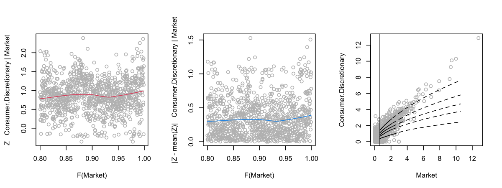
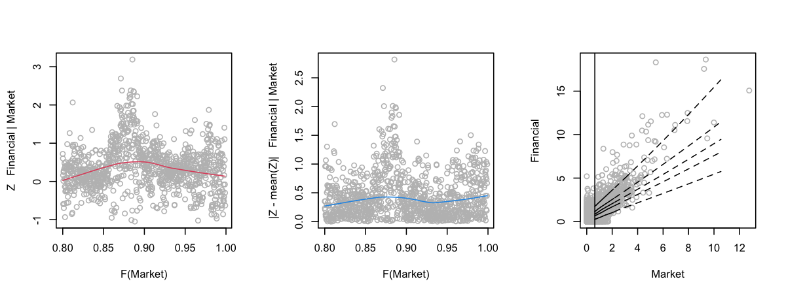
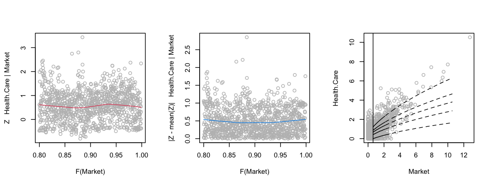
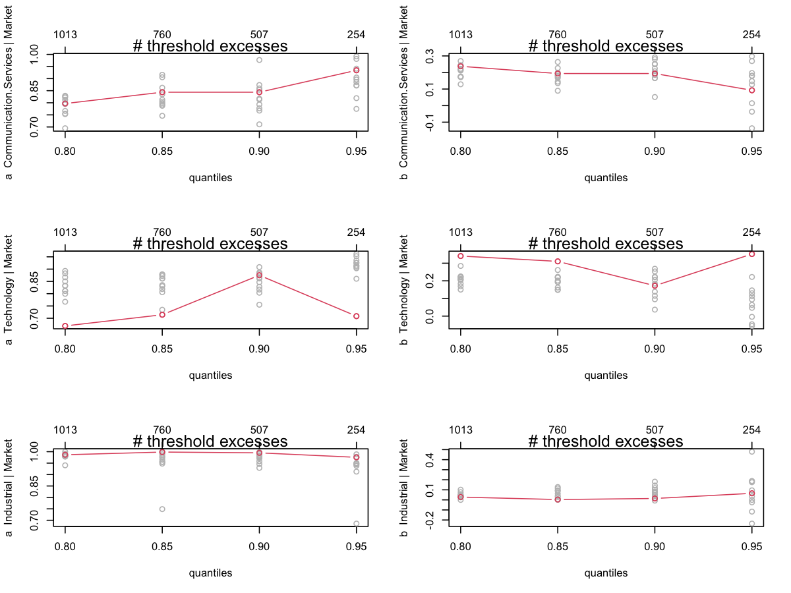
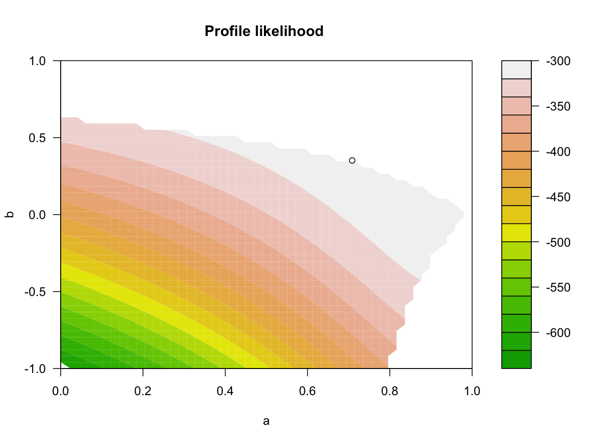
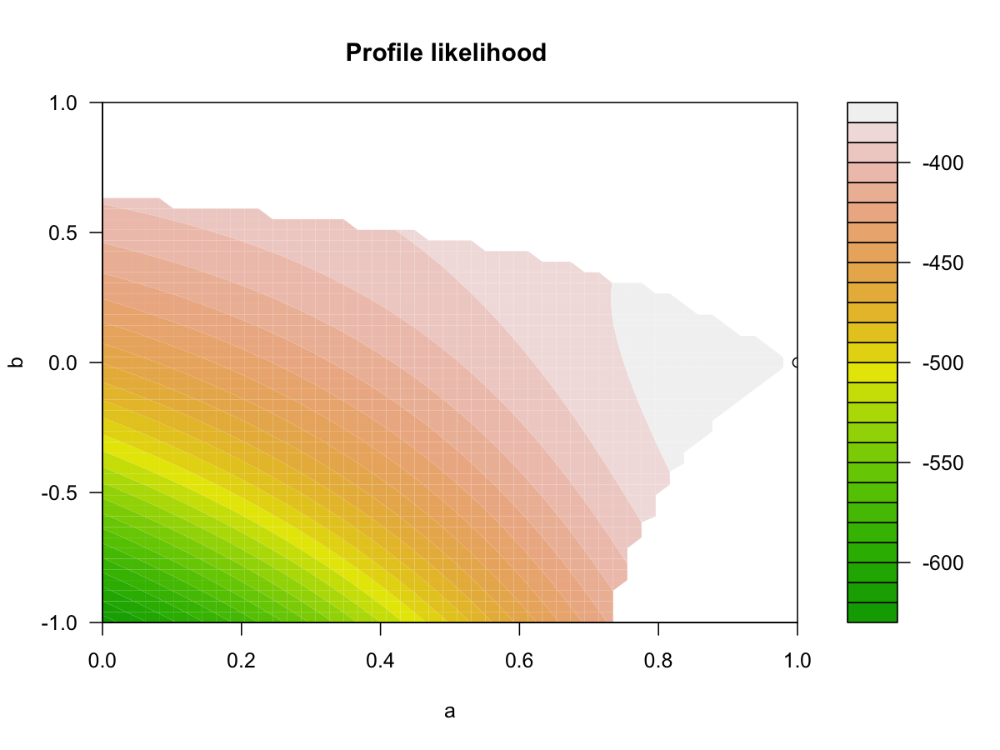
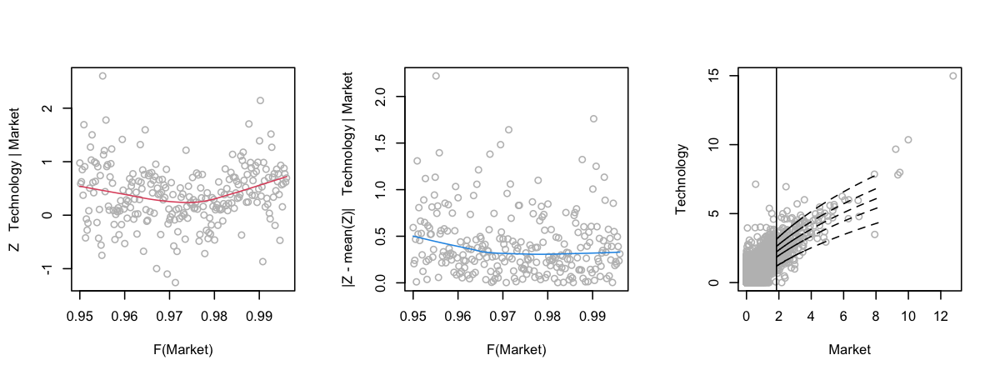
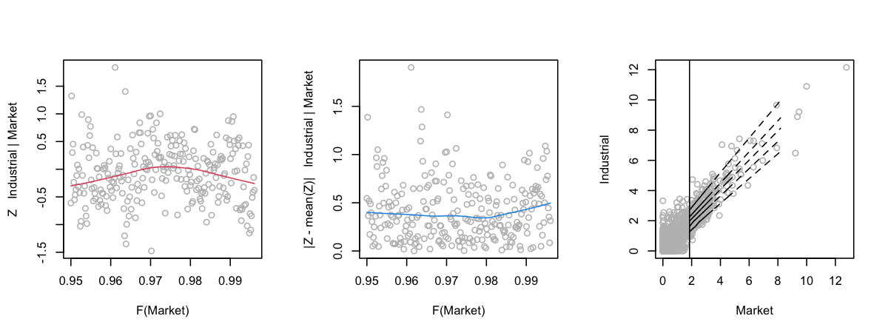
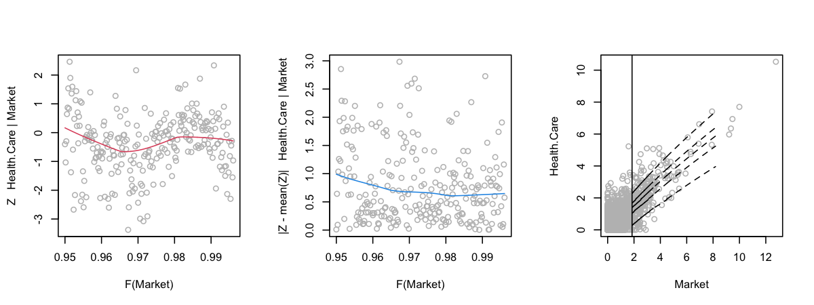

Test Package texmex
================
Mongi Nouira

## Marginal GPD Model Fit

### Summary

    ##                  Market Communication.Services Technology Industrial Materials
    ## Threshold          1.22                   1.38      1.645       1.38      1.57
    ## P(X < threshold)   0.90                   0.90      0.900       0.90      0.90
    ## sigma              0.85                   0.99      1.069       0.95      1.05
    ## xi                 0.19                   0.14      0.074       0.17      0.16
    ## Upper end point     Inf                    Inf        Inf        Inf       Inf
    ##                  Consumer.Discretionary Financial Health.Care Consumer.Staples
    ## Threshold                          1.45      1.67        1.14             0.92
    ## P(X < threshold)                   0.90      0.90        0.90             0.90
    ## sigma                              0.90      1.15        0.74             0.55
    ## xi                                 0.15      0.32        0.17             0.23
    ## Upper end point                     Inf       Inf         Inf              Inf
    ##                  Utilities Real.Estate Energy
    ## Threshold             1.25        1.59   1.85
    ## P(X < threshold)      0.90        0.90   0.90
    ## sigma                 0.73        1.07   1.09
    ## xi                    0.27        0.42   0.22
    ## Upper end point        Inf         Inf    Inf

### Diagnostic

Done in EDA section.

## Dependence Model Fit

### Summary

    ## Conditioning on Market variable.
    ## Thresholding quantiles for transformed data: dqu = 0.75
    ## Using laplace margins for dependence estimation.
    ## Constrained estimation of dependence parameters using v = 10 .
    ## Log-likelihood = -1793 -1369 -1194 -1561 -1304 -1476 -1583 -1766 -2008 -1860 -1870 
    ## 
    ## Dependence structure parameter estimates:
    ##   Communication.Services Technology Industrial Materials Consumer.Discretionary
    ## a                   0.84      0.895        0.7      0.43                   0.41
    ## b                   0.13      0.068        0.3      0.45                   0.45
    ##   Financial Health.Care Consumer.Staples Utilities Real.Estate Energy
    ## a      0.63        0.65             0.51      0.82        0.83   0.32
    ## b      0.33        0.32             0.30      0.16        0.13   0.38

### Diagnostic

### Dependence Model Threshold Selection

    ## mexRangeFit run time: 507.779 sec elapsed

### Dependence Model 2

    ## Conditioning on Market variable.
    ## Thresholding quantiles for transformed data: dqu = 0.7
    ## Using laplace margins for dependence estimation.
    ## Constrained estimation of dependence parameters using v = 10 .
    ## Log-likelihood = -2097 -1589 -1307 -1722 -1366 -1640 -1821 -2022 -2363 -2192 -2116 
    ## 
    ## Dependence structure parameter estimates:
    ##   Communication.Services Technology Industrial Materials Consumer.Discretionary
    ## a                   0.83      0.884      0.979      0.93                  0.948
    ## b                   0.13      0.075     -0.019      0.10                  0.078
    ##   Financial Health.Care Consumer.Staples Utilities Real.Estate Energy
    ## a     0.925        0.88             0.82      0.79        0.77   0.87
    ## b     0.097        0.14             0.15      0.15        0.14   0.13

